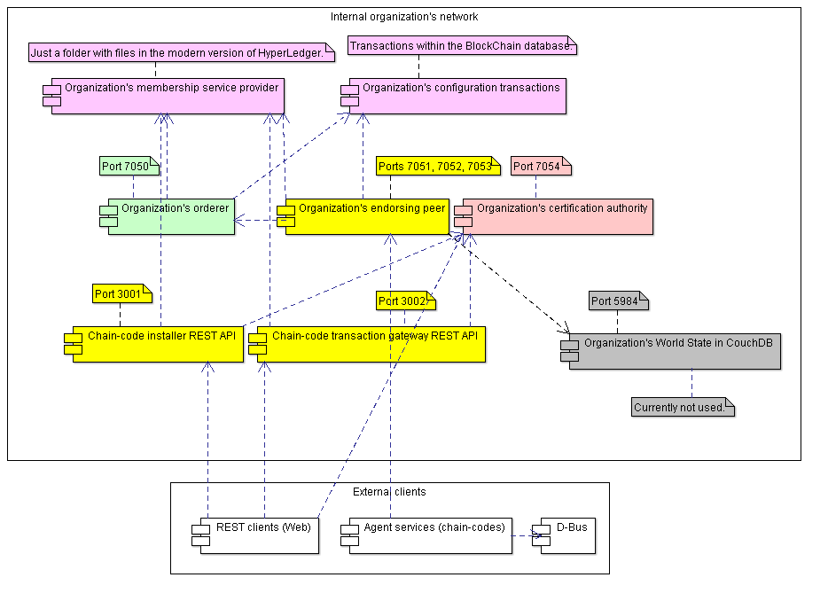

# HyperLedger Organization deployment
## HyperLedger Organization UML deployment diagram
Below is the UML component diagram for a single-organization HyperLedger network. The diagram contains:
- Deployed components;
- Their TCP ports;
- Interconnections between these components;
- System frontiers.

